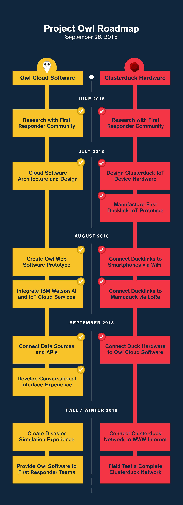

 

_INSTRUCTIONS: This GitHub repository serves as a template and example you can use to create a well documented README for your project for the [2024 Call for Code Global Challenge](https://developer.ibm.com/callforcode/global-challenge/)._

Your required deliverables and project descriptions should be officially submitted to your My Team > Submissions section of the [Call for Code Global Challenge web site](https://compete.callforcode.skillsnetwork.site/competitions/2024-call-for-code-global-challenge), but you can also optionally include them here for completeness, as it is good practice to clearly document your project in your README file. Replace the examples seen here with your own deliverable links.

Use the **Use this template** button to create a new version of this repository and start entering content for your own Call for Code submission project. Make sure you have [registered for the 2024 Call for Code Global Challenge](https://www.ibm.com/account/reg/signup?formid=urx-52643) to access resources and full project submission instructions. Remove any "INSTRUCTIONS" sections when you are ready to submit your project.

_New to Git and GitHub? This free online course will get you up to speed quickly: [Getting Started with Git and GitHub](https://www.coursera.org/learn/getting-started-with-git-and-github)_.

# Replace this heading with your team/submission name

- [Project summary](#project-summary)
  - [The issue we are hoping to solve](#the-issue-we-are-hoping-to-solve)
  - [How our technology solution can help](#how-our-technology-solution-can-help)
  - [Our idea](#our-idea)
- [Technology implementation](#technology-implementation)
  - [IBM watsonx product(s) used](#ibm-ai-services-used)
  - [Other IBM technology used](#other-ibm-technology-used)
  - [Solution architecture](#solution-architecture)
- [Presentation materials](#presentation-materials)
  - [Solution demo video](#solution-demo-video)
  - [Project development roadmap](#project-development-roadmap)
- [Additional details](#additional-details)
  - [How to run the project](#how-to-run-the-project)
  - [Live demo](#live-demo)
- [About this template](#about-this-template)
  - [Contributing](#contributing)
  - [Versioning](#versioning)
  - [Authors](#authors)
  - [License](#license)
  - [Acknowledgments](#acknowledgments)

_INSTRUCTIONS: Below are the suggested sections to include in your README file to make sure your project is well documented. You can remove this instruction text._

## Project summary

### The issue we are hoping to solve

REPLACE THIS SENTENCE with a short description, 2-3 sentences in length, of the specific sustainability problem your solution is meant to address.

### How our technology solution can help

REPLACE THIS SENTENCE with a short description of your team's solution, in about 10 words.

### Our idea

INSTRUCTIONS: Replace this paragraph with a longer description of your solution. In about 500 words, describe your solution in more detail. Include the real-world problem you identified, describe the technological solution you have created, and explain how it’s an improvement over existing solutions. You can supply additional documentation in this source code repository that you link to as well.

More detail is available in our [description document](./docs/DESCRIPTION.md).

## Technology implementation

### IBM watsonx product(s) used

_INSTRUCTIONS: Included here is a list of IBM watsonx products. Remove any products you did not use. Leave only those included in your solution code. In your official submission on the Call for Code Global Challenge web site, you are required to provide details on where and how you used each IBM watsonx product so judges can review your implementation. Remove these instructions._

**Featured watsonx products**

- [watsonx.ai](https://www.ibm.com/products/watsonx-ai) - WHERE AND HOW THIS IS USED IN OUR SOLUTION

- [watsonx.governance](https://www.ibm.com/products/watsonx-governance) - WHERE AND HOW THIS IS USED IN OUR SOLUTION

- [watsonx Assistant](https://cloud.ibm.com/catalog/services/watsonx-assistant) - WHERE AND HOW THIS IS USED IN OUR SOLUTION

### Other IBM technology used

INSTRUCTIONS: List any other IBM technology or IBM AI services used in your solution and describe how each component was used. If you can provide details on where these were used in your code, that would help the judges review your submission.

**Additional IBM AI services (Remove any that you did not use)**

- [Watson Machine Learning](https://cloud.ibm.com/catalog/services/watson-machine-learning) - WHERE AND HOW THIS IS USED IN OUR SOLUTION

- [Watson Studio](https://cloud.ibm.com/catalog/services/watson-studio) - WHERE AND HOW THIS IS USED IN OUR SOLUTION

- [Natural Language Understanding](https://cloud.ibm.com/catalog/services/natural-language-understanding) - WHERE AND HOW THIS IS USED IN OUR SOLUTION

- [Speech to Text](https://cloud.ibm.com/catalog/services/speech-to-text) - WHERE AND HOW THIS IS USED IN OUR SOLUTION

- [Text to Speech](https://cloud.ibm.com/catalog/services/text-to-speech) - WHERE AND HOW THIS IS USED IN OUR SOLUTION

- [Language Translator](https://cloud.ibm.com/catalog/services/language-translator) - WHERE AND HOW THIS IS USED IN OUR SOLUTION

### Solution architecture

REPLACE THIS EXAMPLE WITH YOUR OWN, OR REMOVE THIS EXAMPLE

Diagram and step-by-step description of the flow of our solution:

1. The user navigates to the site and uploads a video file.
2. Watson Speech to Text processes the audio and extracts the text.
3. Watson Translation (optionally) can translate the text to the desired language.
4. The app stores the translated text as a document within Object Storage.

## Presentation materials

_INSTRUCTIONS: The following deliverables should be officially posted to your My Team > Submissions section of the [Call for Code Global Challenge resources site](https://cfc-prod.skillsnetwork.site/), but you can also include them here for completeness. Replace the examples seen here with your own deliverable links._

### Solution demo video

### Project development roadmap

The project currently does the following things.

- Feature 1
- Feature 2
- Feature 3

In the future we plan to...

See below for our proposed schedule on next steps after Call for Code 2024 submission.

## Additional details

_INSTRUCTIONS: The following deliverables are suggested, but **optional**. Additional details like this can help the judges better review your solution. Remove any sections you are not using._

### How to run the project

INSTRUCTIONS: In this section you add the instructions to run your project on your local machine for development and testing purposes. You can also add instructions on how to deploy the project in production.

### Live demo

You can find a running system to test at...

See our [description document](./docs/DESCRIPTION.md) for log in credentials.

---

_INSTRUCTIONS: You can remove the below section from your specific project README._

## About this template

### Contributing

Please read [CONTRIBUTING.md](CONTRIBUTING.md) for details on our code of conduct, and the process for submitting pull requests to us.

### Versioning

We use [SemVer](http://semver.org/) for versioning. For the versions available, see the [tags on this repository](https://github.com/your/project/tags).

### Authors

- **Billie Thompson** - _Initial work_ - [PurpleBooth](https://github.com/PurpleBooth)

### License

This project is licensed under the Apache 2 License - see the [LICENSE](LICENSE) file for details.

### Acknowledgments

- Based on [Billie Thompson's README template](https://gist.github.com/PurpleBooth/109311bb0361f32d87a2).
