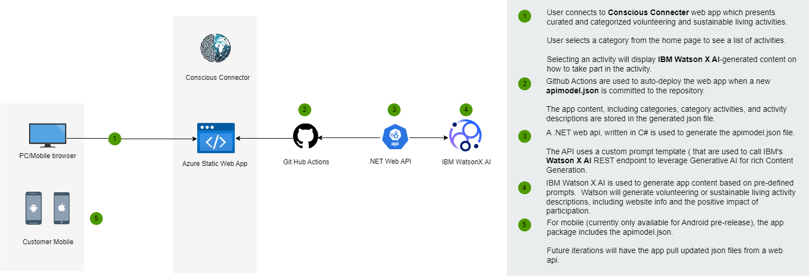

 

_INSTRUCTIONS: This GitHub repository serves as a template and example you can use to create a well documented README for your project for the [2024 Call for Code Global Challenge](https://developer.ibm.com/callforcode/global-challenge/)._

Your required deliverables and project descriptions should be officially submitted to your My Team > Submissions section of the [Call for Code Global Challenge web site](https://compete.callforcode.skillsnetwork.site/competitions/2024-call-for-code-global-challenge), but you can also optionally include them here for completeness, as it is good practice to clearly document your project in your README file. Replace the examples seen here with your own deliverable links.

Use the **Use this template** button to create a new version of this repository and start entering content for your own Call for Code submission project. Make sure you have [registered for the 2024 Call for Code Global Challenge](https://www.ibm.com/account/reg/signup?formid=urx-52643) to access resources and full project submission instructions. Remove any "INSTRUCTIONS" sections when you are ready to submit your project.

_New to Git and GitHub? This free online course will get you up to speed quickly: [Getting Started with Git and GitHub](https://www.coursera.org/learn/getting-started-with-git-and-github)_.

# Conscious Connector

- [Project summary](#project-summary)
  - [The issue we are hoping to solve](#the-issue-we-are-hoping-to-solve)
  - [How our technology solution can help](#how-our-technology-solution-can-help)
  - [Our idea](#our-idea)
- [Technology implementation](#technology-implementation)
  - [IBM watsonx product(s) used](#ibm-ai-services-used)
  - [Other IBM technology used](#other-ibm-technology-used)
  - [Solution architecture](#solution-architecture)
- [Presentation materials](#presentation-materials)
  - [Solution demo video](#solution-demo-video)
  - [Project development roadmap](#project-development-roadmap)
- [Additional details](#additional-details)
  - [How to run the project](#how-to-run-the-project)
  - [Live demo](#live-demo)
- [About this template](#about-this-template)
  - [Contributing](#contributing)
  - [Versioning](#versioning)
  - [Authors](#authors)
  - [License](#license)
  - [Acknowledgments](#acknowledgments)

_INSTRUCTIONS: Below are the suggested sections to include in your README file to make sure your project is well documented. You can remove this instruction text._

## Project summary

### The issue we are hoping to solve

Conscious Connector offers conscientious volunteering and sustainable living opportunities to help users give more meaning to how they spend their time.  The app suggests activities across various categories with the aim of addressing the growing trend of people spending their time in unproductive or environmentally harmful ways.

### How our technology solution can help

REPLACE THIS SENTENCE with a short description of your team's solution, in about 10 words.

### Our idea

Conscious Connector is a mobile application designed to connect users with meaningful and purpose-driven volunteering, and sustainable living activities.

In a world filled with distractions, our free time can often be squandered.  Conscious Connector empowers individuals to engage in activities benefiting their local communities, and ultimately the world at large. The app provides curated volunteering suggestions organized into themed categories, such as food, pets, and home, and sustainable energy use.

Leveraging advanced AI capabilities through IBM's WatsonX AI, the app generates location-specific recommendations that have a measurable impact on the community.

#### Key Features and Benefits
*Curated Activity Suggestions*: 

From the home page, users select a category of interest, and the app displays AI-generated suggestions for conscious ways to spend their time.

 - For instance, in the Food category, users might receive ideas like volunteering for meal preparation at a local food bank or donating canned goods to a charitable organization
 - In the Pets category, recommendations include fostering a pet, volunteering at an animal shelter, or assisting in animal essential care.

*AI-Powered Insights with WatsonX AI*: 

At the heart of Conscious Connector is its integration with WatsonX AI, IBM’s advanced Generative AI platform powering the app's capabilities.

 - Users select a category and activity, the app then displays a Watson X AI generated description.
 - The prompts are sent to WatsonX AI for natural language processing (NLP), and are designed to ensure that the descriptions are relevant and tailored to promote conscious living.

*Environmental and Social Impact*:

Conscious Connector aims to inspire users to rethink how they allocate their time by focusing on activities that contribute positively to the community and environment. Each suggestion encourages personal growth and community engagement, fostering a culture of support and responsibility towards the planet.

*User-Centric Experience (Coming Soon)*: 

The app is designed with a user-friendly interface with ease of navigation in mind. Users can choose categories, view suggested activities, and will eventually be able to share their experiences with others within the app. This interactive design will encourage engagement and grow a community of individuals committed to making a difference.

*Personalized Recommendations (Coming Soon)*:

As additional curated categories and activities are added, the app will learn from the user’s preferences and suggest new-to-you opportunities to make a difference. If a user frequently engages with pet-related activities, the app will prioritize similar suggestions in the future and as they become available.

## Technology implementation

### IBM watsonx product(s) used

_INSTRUCTIONS: Included here is a list of IBM watsonx products. Remove any products you did not use. Leave only those included in your solution code. In your official submission on the Call for Code Global Challenge web site, you are required to provide details on where and how you used each IBM watsonx product so judges can review your implementation. Remove these instructions._

**Featured watsonx products**

- [watsonx.ai](https://www.ibm.com/products/watsonx-ai) - WatsonX AI is used for content generation using prompts engineered by our team.

### Other IBM technology used

 - [IBM Identity and Access Management](https://www.ibm.com/services/identity-access-management) - IBM IAM was used to provide our Web API access to WatsonX AI REST endpoints. used in 

**Additional IBM AI services (Remove any that you did not use)**

- [Watson Machine Learning](https://cloud.ibm.com/catalog/services/watson-machine-learning) - Watson Machine Learning is used in conjuction with WatsonX AI for content generation.

### Solution architecture

REPLACE THIS EXAMPLE WITH YOUR OWN, OR REMOVE THIS EXAMPLE

Diagram and step-by-step description of the flow of our solution:

1. The user navigates to the site and is presented with a list of Conscious Categories.
2. The user selects a category and is presented with a list of activities for volunteering or sustainable living.
3. When an activity is selected, the detailed descriptiion is shown, which includes information on how to volunteer and the positive impact it will have.
   App content is generated by Watson X AI.

## Presentation materials

_INSTRUCTIONS: The following deliverables should be officially posted to your My Team > Submissions section of the [Call for Code Global Challenge resources site](https://cfc-prod.skillsnetwork.site/), but you can also include them here for completeness. Replace the examples seen here with your own deliverable links._

### Solution demo video

### Project development roadmap

The project currently does the following things.

- Feature 1
- Feature 2
- Feature 3

In the future we plan to...

See below for our proposed schedule on next steps after Call for Code 2024 submission.

## Additional details

_INSTRUCTIONS: The following deliverables are suggested, but **optional**. Additional details like this can help the judges better review your solution. Remove any sections you are not using._

### How to run the project

INSTRUCTIONS: In this section you add the instructions to run your project on your local machine for development and testing purposes. You can also add instructions on how to deploy the project in production.

### Live demo

The mobile web app is running at: https://mango-forest-0eab98a0f.5.azurestaticapps.net/home

An Android build of the app can also be downloaded and sideloaded get repo [Release 1.0.0](https://github.com/blackhammer/ibm-cfc2024/releases/tag/1.0.0)

No Authentication is required for this initial release.

---