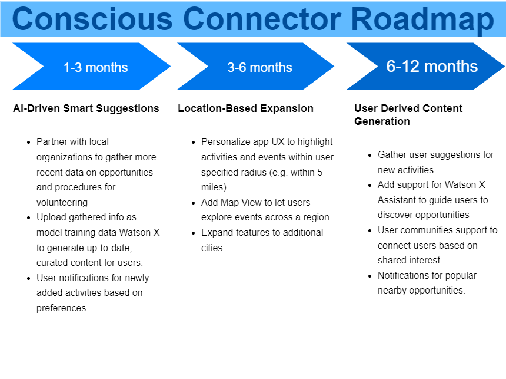

 

# Conscious Connector

- [Project summary](#project-summary)
  - [The issue we are hoping to solve](#the-issue-we-are-hoping-to-solve)
  - [How our technology solution can help](#how-our-technology-solution-can-help)
  - [Our idea](#our-idea)
- [Technology implementation](#technology-implementation)
  - [IBM watsonx product(s) used](#ibm-ai-services-used)
  - [Other IBM technology used](#other-ibm-technology-used)
  - [Solution architecture](#solution-architecture)
- [Presentation materials](#presentation-materials)
  - [Solution demo video](#solution-demo-video)
  - [Project development roadmap](#project-development-roadmap)
- [Additional details](#additional-details)
  - [How to run the project](#how-to-run-the-project)
  - [Live demo](#live-demo)

## Project summary

### The issue we are hoping to solve

Conscious Connector offers conscientious volunteering and sustainable living opportunities to help users give more meaning to how they spend their time.  The app suggests activities across various categories with the aim of addressing the growing trend of people spending their time in unproductive or environmentally harmful ways.

### How our technology solution can help

Conscious Connector offers meaningful opportunities to give back to communities.

### Our idea

Conscious Connector is a mobile application designed to connect users with meaningful and purpose-driven volunteering, and sustainable living activities.

In a world filled with distractions, our free time can often be squandered.  Conscious Connector empowers individuals to engage in activities benefiting their local communities, and ultimately the world at large. The app provides curated volunteering suggestions organized into themed categories, such as food, pets, and home, and sustainable energy use.

Leveraging advanced AI capabilities through IBM's WatsonX AI, the app generates location-specific recommendations that have a measurable impact on the community.

#### Key Features and Benefits
*Curated Activity Suggestions*: 

From the home page, users select a category of interest, and the app displays AI-generated suggestions for conscious ways to spend their time.

 - For instance, in the Food category, users might receive ideas like volunteering for meal preparation at a local food bank or donating canned goods to a charitable organization
 - In the Pets category, recommendations include fostering a pet, volunteering at an animal shelter, or assisting in animal essential care.

*AI-Powered Insights with WatsonX AI*: 

At the heart of Conscious Connector is its integration with WatsonX AI, IBM’s advanced Generative AI platform powering the app's capabilities.

 - Users select a category and activity, the app then displays a Watson X AI generated description.
 - The prompts are sent to WatsonX AI for natural language processing (NLP), and are designed to ensure that the descriptions are relevant and tailored to promote conscious living.

*Environmental and Social Impact*:

Conscious Connector aims to inspire users to rethink how they allocate their time by focusing on activities that contribute positively to the community and environment. Each suggestion encourages personal growth and community engagement, fostering a culture of support and responsibility towards the planet.

*User-Centric Experience (Coming Soon)*: 

The app is designed with a user-friendly interface with ease of navigation in mind. Users can choose categories, view suggested activities, and will eventually be able to share their experiences with others within the app. This interactive design will encourage engagement and grow a community of individuals committed to making a difference.

*Personalized Recommendations (Coming Soon)*:

As additional curated categories and activities are added, the app will learn from the user’s preferences and suggest new-to-you opportunities to make a difference. If a user frequently engages with pet-related activities, the app will prioritize similar suggestions in the future and as they become available.

## Technology implementation

### IBM watsonx product(s) used

**Featured watsonx products**

- [watsonx.ai](https://www.ibm.com/products/watsonx-ai) - WatsonX AI is used for content generation using prompts engineered by our team.

### Other IBM technology used

 - [IBM Identity and Access Management](https://www.ibm.com/services/identity-access-management) - IBM IAM was used to provide our Web API access to WatsonX AI REST endpoints. used in 

**Additional IBM AI services (Remove any that you did not use)**

- [Watson Machine Learning](https://cloud.ibm.com/catalog/services/watson-machine-learning) - Watson Machine Learning is used in conjuction with WatsonX AI for content generation.

### Solution architecture

Diagram and step-by-step description of the flow of our solution:

1. The user navigates to the site and is presented with a list of Conscious Categories.
2. The user selects a category and is presented with a list of activities for volunteering or sustainable living.
3. When an activity is selected, the detailed descriptiion is shown, which includes information on how to volunteer and the positive impact it will have.
   App content is generated by Watson X AI.

## Presentation materials

### Solution demo video

### Project development roadmap

The solution currently has the following capabilities:

- Display AI-generated content for local volunteering and sustainable living opportunities.
  - Prototype developed for the Greater Montreal Area in Canada.
- Available as an Android app (downloadble from github release) and mobile web site.
- Backend API used to generate or updated app content

In the future we plan to...

See below for our proposed schedule on next steps after Call for Code 2024 submission.

## Additional details

### How to run the project

Development for this solution done with Visual Studio Code on Windows and Linux (WSL2).

The solution has two components that can be run on a local desktop.  The development environemt was:

- .NET Web API: Windows 11
- ReactNative App: Archlinux on WSL2 (Windows Subsystem For Linux)

However, both solutions can be setup to run on either Windows, Linux or MacOS

#### Setup React Native development environment
The ReactNative app uses Expo. Development environment instructions found here: 

[Setup Expo](https://docs.expo.dev/get-started/set-up-your-environment/?mode=development-build&buildEnv=local)
- This project uses 'Android Device' and 'Development Build', and 'unselect' 'Build with Expo Application Services(EAS)'

However, if desired, it is also enough to run the mobile web version of the app

#### Setup for mobile web development only

- Install NodeJs LTS
- Git clone the project and navigate to ui root folder: ./src/ui/conscious-connect/
- In project root folder, run: npx expo install expo-dev-client
- npx expo start
  - the project will be served on http://localhost:8081/
- Use the browser's development menu (CTRL+Shift+i in Chrome/Edge) to switch to 'Responsive' dimensions

#### Setup .NET Web API

On the platform of choice, install .NET 8 from Microsoft (or via package manager on Linux):

[Setup .NET LTS](https://dotnet.microsoft.com/en-us/download/dotnet/8.0)

- Open the solution folder in VS Code
- From menu, choose Run -> Start Debugging to run project.
- *Replace IBM IAM API Key in file ./src/api/WatsonXAPI/secrets/Your-IBM-API-KEY.json
- *Replace projectid with your own Watson X AI projectid in file: /src/api/WatsonXAPI/Prompts/WatsonXInput.json

### Live demo

The mobile web app is running at (best viewed on mobile browser): https://mango-forest-0eab98a0f.5.azurestaticapps.net/home

An Android build of the app can also be downloaded and sideloaded get repo [Release 1.0.0](https://github.com/blackhammer/ibm-cfc2024/releases/tag/1.0.0)

No Authentication is required for this initial release.

---