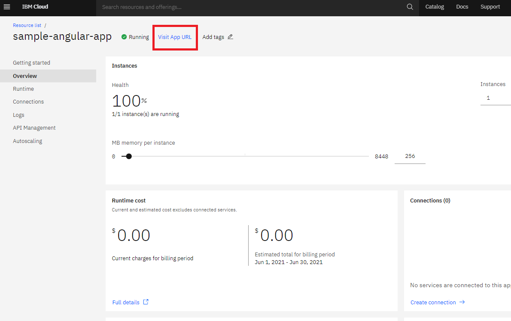

### Deploy the App on [IBM Cloud Foundry](https://cloud.ibm.com/docs/cloud-foundry-public?topic=cloud-foundry-public-getting-started)

To deploy your angular app on [IBM Cloud Foundry](https://cloud.ibm.com/docs/cloud-foundry-public?topic=cloud-foundry-public-getting-started) follow the steps;

- Install [IBM Cloud CLI](https://cloud.ibm.com/docs/cli?topic=cli-getting-started).
- Start a terminal/CMD in `~/Project-Sample/sample-angular-app/dist/sample-angular-app` directory.
- Login to IBM Cloud from CLI by executing the command `ibmcloud login`.
- Create [IBM Cloud organization and space](https://cloud.ibm.com/docs/account?topic=account-orgsspacesusers) from your [IBM Cloud Account UI console](https://cloud.ibm.com/docs/account?topic=account-orgsspacesusers#createorg) or from [IBM Cloud CLI](https://cloud.ibm.com/docs/account?topic=account-orgsspacesusers#create-org-cli).
- To deploy your app in IBM Cloud Foundry service you need to assign a Cloud Foundry org and space. Execute command `ibmcloud target --cf` which promts an interactive **org** and **space** selection step in the terminal/CMD. If there is only one **org** and **space** set then they will be assigned by default.
- To deploy your app in IBM Cloud Foundry a **manifest.yml** file is required. This sample react app already has a [~/Project-Sample/sample-angular-app/manifest.yml](../manifest.yml) file. Edit the **name** entry with your app name. You can leave rest of the entries with default entries or modify them as per your requirement. To learn more about IBM Cloud Foundry Manifest attributes visit the [Cloud Foundry Document](https://docs.cloudfoundry.org/devguide/deploy-apps/manifest-attributes.html).
- Now execute command `ibmcloud app push` in the terminal/CMD. A Cloud Foundry service with the app name will be created, your project's `/dist/sample-angular-app` folder contents will be uploaded and the app will be started. You will get a summary of your deployment in the terminal/CMD after successful deployment with an App URL under `routes:` section to access in web browser. You can also see the Cloud Foundry service running in your [IBM Cloud Foundry dashboard](https://cloud.ibm.com/cloudfoundry/public) and access the App URL link and other information like Health Status, Runtime, Logs, etc.

    

### Important Notes:
- If your Cloud Foundry service is Lite/Free plan then it sleeps after 10 days of development inactivity. Keep your Cloud Foundry service active by re-deploying your app once every 10 days. You can automate the re-deploy process using [Git Actions `schedule` event](https://docs.github.com/en/actions/reference/events-that-trigger-workflows#schedule).

- To deploy any updates or re-deploy your the app for the same Cloud Foundry instance, you can use the command `ibmcloud cf push APP-NAME`.