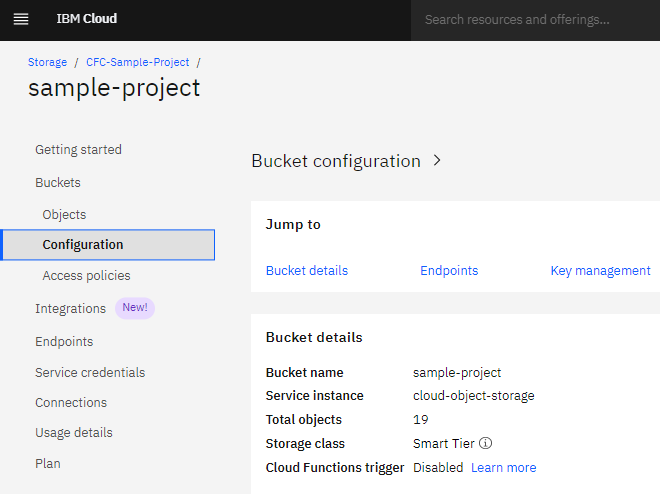

#### Deploy the App in [IBM Cloud Object Storage](https://cloud.ibm.com/docs/cloud-object-storage?topic=cloud-object-storage-getting-started-cloud-object-storage)
- Log into your [IBM Cloud account](https://cloud.ibm.com/login).
- Enter `Object Storage` in the console's search bar and select **Object Storage**.
  

    
  

- Next configure the Object Storage by selecting the right plan **Lite** or **Standard** as per your requirement, enter a **Service name**, **select a resource group** and optionally enter a **Tags**.
  

    
  

- Now your Object Storage will be created and you will be routed to its dashboard. Select **Create bucket** tab and click on **Create Bucket** button.
  

    
  

- Configure the bucket by entering a **Unique bucket name**, select the required **Resiliency**, **Locaton** and **Storage class** options. Then under **Rules & Policies** configure **Static website hosting** by clicking **Add rule**, turn on the **Public access** switch and enter `index.html` for **Index document** placeholder and save. Finally click **Create Bucket** button end of the page.
    

      
    

    

      
    

- Now a bucket will be created and shown in your Cloud Object Storage dashboard. Click on the bucket created.
    

      
    

- Click on the **Upload** button and upload all the contents in `~/Project-Sample/sample-react-app/build` directory which was created when you built the app. 
**NOTE:** You will have to **Install Aspera connect** to upload large files and any folders. For this sample react app you need to use **Aspera connect** to upload the **static** folder in `~/Project-Sample/sample-react-app/build` directory.
    

      
    

- Once uploading is complete, select **Configuration** for the bucket.
    

      
    

- Scroll down to the very bottom of the page and you will find the URL endpoints for the App that can be shared to access the Sample react app in the browser.
    

      
    

### Important Notes:

  - Once a Bucket is created for a Cloud Object Storage, don't delete it. You can build your App with new changes and upload the `~/Project-Sample/sample-react-app/build` contents for the same Bucket. If you delete the Bucket you won't be able create another with the same name and you will have to wait for 7 days for the same name. Learn more about the [Cloud Object Storage delete bucket](https://cloud.ibm.com/docs/cloud-object-storage?topic=cloud-object-storage-compatibility-api-bucket-operations#compatibility-api-delete-bucket).

  - If your Cloud Object Storage (COS) is Lite/Free plan then it will be deleted after 30 days of inactivity. Keep your COS active by uploading the `~/Project-Sample/sample-react-app/build` contents in the bucket once in a while every month. You can automate the re-deploy/uploading process using [Git Actions `schedule` event](https://docs.github.com/en/actions/reference/events-that-trigger-workflows#schedule)